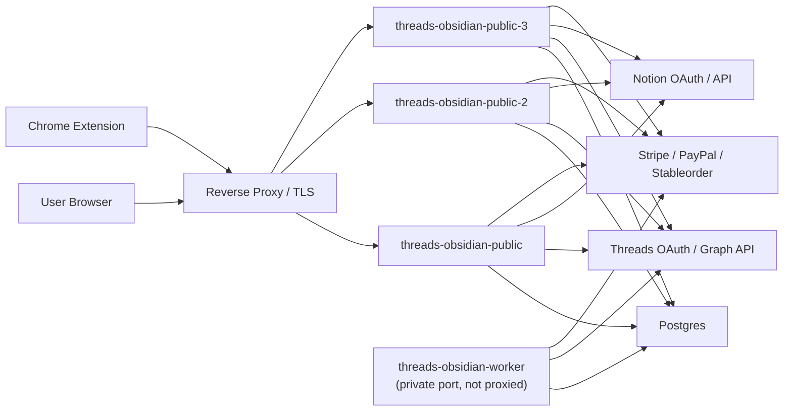

# 배포 아키텍처

기준일: `2026-03-29`

## 1. 한 줄 요약

현재 운영 배포는 `reverse proxy -> public PM2 pool -> worker 1개 -> postgres` 구조다. 단일 `threads-obsidian` 프로세스 문서는 더 이상 운영 기준이 아니다.

## 2. 실제 운영 토폴로지



## 3. 프로세스 역할

- `threads-obsidian-public`, `threads-obsidian-public-2`, `threads-obsidian-public-3`
  - reverse proxy 뒤에서 public web, checkout, scrapbook, admin, public/admin API를 처리
  - `THREADS_WEB_DISABLE_COLLECTOR=true`
  - `THREADS_WEB_DISABLE_MONITORING_AUTORUN=true`
- `threads-obsidian-worker`
  - private 포트에서 실행
  - background collector / monitoring autorun을 담당
  - reverse proxy에 직접 붙이지 않음

구성 파일:

- split-role 운영: `ecosystem.scale.config.cjs`
- 단일 프로세스 로컬/호환 실행: `ecosystem.config.cjs`

## 4. 데이터와 설정

- 프로덕션 애플리케이션 데이터 저장소는 `postgres`가 기준이다.
- 서버 코드는 `NODE_ENV=production`에서 file backend 기동을 허용하지 않는다.
- 런타임 설정 파일 기본 경로는 `output/web-runtime-config.json`이다.
- 로컬/호환용 파일 저장소 예시는 `output/web-admin-data.json`이지만, 운영 기준 저장소 설명으로 사용하면 안 된다.

핵심 환경변수:

- `THREADS_WEB_STORE_BACKEND=postgres`
- `THREADS_WEB_POSTGRES_URL` 또는 `THREADS_WEB_DATABASE_URL`
- `THREADS_WEB_PUBLIC_ORIGIN=https://ss-threads.dahanda.dev`
- `THREADS_WEB_TRUST_PROXY_ALLOWLIST`
- `THREADS_WEB_PUBLIC_PORT`, `THREADS_WEB_WORKER_PORT`, `THREADS_PM2_PUBLIC_INSTANCES`

## 5. reverse proxy와 readiness

reverse proxy는 다음 책임을 가진다.

- HTTPS 종단
- public 라우팅
- 필요 시 admin origin 분리
- `X-Forwarded-*` 전달

운영 게이트는 `/ready`다.

- `databaseLoaded=true`
- `trustProxy.ready=true`
- `security.publicOrderRateLimit` 존재

`trustProxy.ready=false`면 forwarded header는 들어오지만 proxy allowlist가 맞지 않는 상태다.

## 6. storefront와 다국어 정책

- storefront 판매 문구는 DB persisted settings가 우선이다.
- 가격, 플랜 이름, FAQ, hero note, included updates를 바꾸는 배포에서는 `/api/admin/storefront-settings` 동기화가 필수다.
- 비한국어 랜딩/설치/스크랩북 문구는 한국어 persisted storefront를 자동 번역하지 않는다.
- 비한국어 문구는 코드에서 직접 번역으로 관리한다.
- 월간 가격 `US$2.99` 고정은 현재 정책이다.

## 7. 배포 절차

1. 로컬에서 `npm run typecheck`, `npm test`, `npm run build`를 통과시킨다.
2. 운영 서버의 런타임 데이터와 설정을 백업한다.
3. `rsync`로 `/home/ubuntu/projects/threads`에 반영한다.
4. 서버에서 `npm run build`를 실행한다.
5. storefront 판매 문구 변경이 있으면 persisted storefront를 먼저 동기화한다.
6. 아래 명령으로 split-role PM2를 재시작한다.

```bash
pm2 restart threads-obsidian-public threads-obsidian-public-2 threads-obsidian-public-3 threads-obsidian-worker --update-env && pm2 save
```

7. `https://ss-threads.dahanda.dev/health`, `/ready`, `/api/public/storefront`, `/checkout`을 검증한다.

## 8. 운영 서버 기준값

- SSH alias: `openclaw-oracle`
- app path: `/home/ubuntu/projects/threads`
- public origin: `https://ss-threads.dahanda.dev`
- PM2 process set:
  - `threads-obsidian-public`
  - `threads-obsidian-public-2`
  - `threads-obsidian-public-3`
  - `threads-obsidian-worker`
