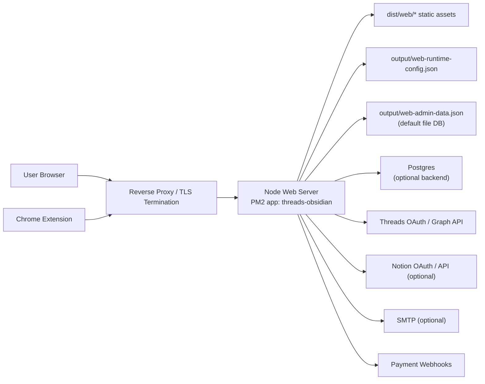

# 배포 아키텍처

기준일: `2026-03-28`

프로젝트: `Threads Archive`

## 1. 문서 목적

이 문서는 현재 `Threads Archive`의 실제 배포 구조를 운영 관점에서 한 번에 이해할 수 있게 정리한 문서다.

대상 범위:

- public landing / scrapbook 웹앱
- admin console
- public API / admin API / extension API
- mention collector
- 런타임 설정 저장소
- 데이터 저장소
- reverse proxy 전제

이 문서는 `현재 운영 기준의 아키텍처 설명`이다.
기능 설계 자체는 별도 문서를 본다.

- OAuth 모바일 우회 플로우: `docs/threads-oauth-polling-flow.md`
- admin 보안 운영 주의사항: `docs/admin-security-operational-notes.md`
- 상업 운영 하드닝 계획: `docs/cloud-save-commercial-hardening-plan.md`

## 2. 한 줄 요약

현재 배포 구조는 다음과 같다.

- public domain 뒤에 reverse proxy가 있음
- 애플리케이션 본체는 `Node.js` 웹 서버 1개 프로세스
- 프로세스 관리는 `PM2`
- 정적 웹앱과 API, collector가 같은 서버 프로세스 안에서 함께 동작
- 기본 저장소는 파일 DB이며, 선택적으로 Postgres 사용 가능
- `Cloudflare Workers`, `D1`, `KV`, `Durable Objects`, `Queues`는 현재 사용하지 않음

즉, 현재 구조는 `edge runtime`이 아니라 `전통적인 Node 서버 + reverse proxy` 구조다.

## 3. 현재 배포 토폴로지



설명:

- 브라우저와 extension은 모두 public origin으로 들어온다.
- reverse proxy가 TLS와 외부 라우팅을 담당한다.
- 실제 앱 로직은 Node 서버 한 프로세스가 처리한다.
- collector도 별도 worker가 아니라 같은 프로세스 안에서 돌아간다.
- 저장소는 기본적으로 파일 기반 JSON DB이고, 운영 필요 시 Postgres로 전환할 수 있다.

## 4. 현재 운영 기준 구성

현재 운영 기준으로 보면 다음이 핵심이다.

- public origin: `https://threads-archive.dahanda.dev`
- admin origin: 가능하면 `https://admin.threads-archive.dahanda.dev`
- Node 프로세스: `dist/web/server.js`
- PM2 앱 이름: `threads-obsidian`
- reverse proxy: repo 밖에서 관리

중요:

- `nginx` 또는 다른 reverse proxy 설정 파일은 현재 repo에 포함돼 있지 않다.
- 즉, repo 안에는 애플리케이션 코드와 PM2 실행 정의만 있고, 실제 외부 라우팅/TLS 설정은 운영 인프라 바깥에서 관리된다.

## 5. 코드 기준 런타임 구조

현재 서버는 Workers 스타일 런타임이 아니라 Node 런타임 전제다.

근거:

- `node:http` 직접 사용
- `node:fs/promises` 사용
- `node:path` 사용
- `node:dns/promises`, `node:net` 사용

관련 코드:

- `packages/web-server/src/server.ts`
- `packages/web-server/src/server/bot-service.ts`

즉 다음 전제가 깔려 있다.

- 서버가 자체 HTTP listener를 띄운다
- 로컬 파일시스템에 접근한다
- 프로세스 메모리와 interval timer를 사용한다

따라서 현재 구조는 Cloudflare Workers 같은 edge runtime으로 즉시 치환 가능한 형태가 아니다.

## 6. 프로세스 실행 방식

PM2 실행 정의는 `ecosystem.config.cjs`에 있다.

핵심 내용:

- 앱 이름: `threads-obsidian`
- 작업 디렉터리: repo 루트
- 실행 방식: bash로 `.env`를 읽은 뒤 `node dist/web/server.js` 실행
- `autorestart: true`

즉 현재 서버 프로세스는 대략 아래 순서로 올라간다.

1. `.env` 로드
2. build 결과물 `dist/web/server.js` 실행
3. PM2가 프로세스를 유지

운영 기본 명령:

```bash
npm run build
pm2 start ecosystem.config.cjs
pm2 save
```

재배포 시 일반적으로는 다음 흐름을 쓴다.

```bash
npm run build
pm2 restart threads-obsidian --update-env
pm2 save
```

## 7. reverse proxy 역할

reverse proxy는 repo 밖에서 관리되지만, 현재 아키텍처상 반드시 필요하다.

역할:

- HTTPS 종단 처리
- public domain 라우팅
- 선택적으로 admin origin 분리
- forwarded header 전달
- http -> https redirect

운영자가 맞춰야 할 핵심 값:

- `THREADS_WEB_PUBLIC_ORIGIN`
- `THREADS_WEB_ADMIN_ORIGIN`
- `THREADS_WEB_TRUST_PROXY_ALLOWLIST`

프록시 뒤 운영 시 `THREADS_WEB_TRUST_PROXY_ALLOWLIST`를 넣지 않으면 admin IP 판정이 어긋날 수 있다.

## 8. 라우팅 구조

### public 영역

대표 경로:

- `/`
- `/landing`
- `/scrapbook`
- `/checkout`
- `/api/public/*`
- `/api/extension/*`

public origin은 기본적으로 `THREADS_WEB_PUBLIC_ORIGIN`을 기준으로 canonical과 OAuth callback, 공개 링크를 생성한다.

### admin 영역

대표 경로:

- `/admin`
- `/api/admin/*`

권장:

- admin은 가능하면 별도 origin으로 분리
- 별도 DNS, TLS, reverse proxy 규칙 적용

### legacy host

과거 public host로 들어오는 일부 페이지는 현재 public origin으로 redirect되도록 정리돼 있다.
다만 일부 API/OAuth 경로는 기존 클라이언트 호환성 때문에 강제 redirect하지 않을 수 있다.

## 9. 정적 파일과 서버 책임 분리

현재 build 결과는 다음처럼 나뉜다.

- extension build: `dist/extension/*`
- web client build: `dist/web/assets/*`
- server build: `dist/web/server.js`

Node 서버는 두 역할을 같이 수행한다.

- 정적 파일 서빙
- API 및 서버 렌더링 HTML 응답

즉 지금은 `Next.js SSR`이나 `SPA on CDN + API on separate backend` 구조가 아니라, `정적 파일과 API를 같은 Node 서버가 같이 제공`하는 구조다.

## 10. 데이터 저장 구조

### 10-1. runtime config 저장소

runtime config 기본 파일:

- `output/web-runtime-config.json`

이 파일에는 다음 계열 설정이 저장된다.

- public origin
- database backend 선택
- Postgres URL
- SMTP 설정
- collector 설정

주의:

- 저장된 runtime config와 현재 활성 runtime config는 다를 수 있다
- 활성 config는 프로세스 메모리에도 유지된다
- 따라서 DB 설정 변경 후에는 재시작 절차가 필요하다

### 10-2. 애플리케이션 데이터 저장소

기본 파일 DB:

- `output/web-admin-data.json`

기본 동작:

- backend 기본값은 `file`
- 파일 DB는 단일 파일 JSON 저장소

선택 backend:

- `postgres`

현재 Postgres backend는 정규화 테이블 기반이라기보다 `JSONB store` 성격에 가깝다.
즉 확장성은 file backend보다 낫지만, 장기적으로는 별도 정규화가 더 적합하다.

### 10-3. 어떤 경우에 어떤 저장소를 쓰는가

`file` backend가 맞는 경우:

- 단일 인스턴스 운영
- 저트래픽
- 빠른 셋업

`postgres` backend가 맞는 경우:

- 다중 인스턴스
- 운영 안정성 강화
- 파일 잠금 기반 저장소 한계를 피하고 싶을 때

## 11. background collector 구조

mention collector는 별도 서버나 큐 워커가 아니다.

현재 구조:

- web server 프로세스 안에서 실행
- interval 기반 polling
- Threads API에서 mention을 읽어 scrapbook archive로 반영

의미:

- 앱 프로세스가 죽으면 collector도 같이 멈춘다
- web/API/collector가 같은 장애 도메인에 있다
- scale out 시 collector 중복 실행 위험을 따로 고려해야 한다

기본 collector 설정:

- interval: `60000ms`
- fetch limit: `25`
- max pages: `5`

## 12. OAuth 및 외부 연동 위치

### Threads OAuth / Graph API

용도:

- scrapbook 로그인
- mention collector
- profile/search/insights 고급 기능

관련 env:

- `THREADS_BOT_APP_ID`
- `THREADS_BOT_APP_SECRET`
- `THREADS_BOT_HANDLE`
- `THREADS_BOT_GRAPH_API_VERSION`

### Notion OAuth

용도:

- Notion 연결 및 저장

관련 env:

- `THREADS_NOTION_CLIENT_ID`
- `THREADS_NOTION_CLIENT_SECRET`
- `THREADS_NOTION_ENCRYPTION_SECRET`

필수 redirect URI:

- `https://threads-archive.dahanda.dev/api/public/notion/oauth/callback`

### SMTP

용도:

- 주문/라이선스 메일 발송

### Payment webhook

현재 서버는 결제 webhook도 함께 처리한다.
즉 storefront, admin, webhook, scrapbook SaaS가 같은 서버에 공존한다.

## 13. 배포 절차

현재 기준 표준 배포 절차:

1. 서버에 최신 코드 반영
2. `npm run build`
3. PM2 재시작
4. health/readiness 확인
5. public/admin 주요 화면 smoke test

권장 점검:

- `GET /health`
- `GET /ready`
- `GET /api/public/storefront`
- `GET /scrapbook`
- `GET /api/public/bot/config`
- `GET /admin`

## 14. 백업과 복구

file backend 기준 최소 백업:

```bash
cp "$THREADS_WEB_DB_FILE" "$THREADS_WEB_DB_FILE.backup-$(date +%F_%H%M%S)"
```

주의:

- file backend는 애플리케이션 상태의 핵심 저장소다
- 배포 전 백업을 권장한다
- runtime config 파일도 함께 백업하는 편이 안전하다

Postgres backend를 쓰는 경우:

- DB dump 정책은 운영 DB 표준 절차를 따른다
- 앱 재배포와 DB 백업은 별도 정책으로 관리한다

## 15. 운영 제약

현재 구조에서 반드시 기억할 제약:

- DB 설정 변경은 hot switch가 아니라 `저장 -> 재시작` 절차
- 다중 인스턴스면 전 인스턴스를 같이 재기동해야 함
- admin은 same-origin public 운영보다 분리 운영이 안전
- HTTPS 없이 admin 원격 접근은 금지 수준으로 봐야 함
- collector가 같은 프로세스에 있으므로 앱 재시작 시 수집도 잠시 멈춤

## 16. 현재 구조에 없는 것

현재 repo와 운영 구조에는 아래가 없다.

- Cloudflare Workers 기반 API 런타임
- D1 / KV / Durable Objects / Queues 기반 저장소
- Dockerfile / docker-compose 기반 표준 배포 정의
- repo 안에 포함된 nginx 설정 파일
- collector 전용 독립 worker 서비스

즉 현재는 `Node monolith + PM2 + reverse proxy` 구조로 이해하는 것이 맞다.

## 17. 문서 관리 원칙

이 문서는 실제 운영 구조가 바뀔 때 같이 갱신해야 한다.

특히 아래가 바뀌면 반드시 수정한다.

- public/admin domain
- process manager
- reverse proxy 구조
- DB backend 기본값
- multi-instance 여부
- collector 분리 여부
- edge runtime 도입 여부

현재 기준 결론:

- 개발 문서에는 운영 정보가 일부 흩어져 있음
- 이 문서는 그 흩어진 정보를 `현재 배포 아키텍처` 기준으로 묶은 기준 문서다
