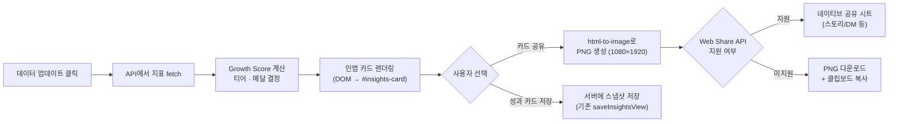

# SS Threads — 성과 카드 (Growth Card) 리디자인 계획서

> **문서 목적**: "카드 공유" 버튼을 눌렀을 때 생성되는 성과 카드를 **공유하고 싶은 프리미엄 카드**로 재설계한다.
> **벤치마크**: Spotify Wrapped · Instagram Year-in-Review · YouTube Play Button · Threads 공식 Insights

---

## 1. 벤치마크 분석

### 1-1. Spotify Wrapped — "데이터를 스토리로"
| 원칙 | 적용 |
|---|---|
| **Identity Signaling** | 수치가 아닌 "너는 이런 사람이야"로 프레이밍 |
| **3초 룰** | 한눈에 읽히는 단일 히어로 숫자 |
| **Share-First** | 카드 자체가 9:16 세로형, 스토리 공유 최적화 |
| **연간 귀환 동기** | "작년의 나 vs 올해의 나" 비교 |

### 1-2. YouTube Play Button — "마일스톤 뱃지"
| 원칙 | 적용 |
|---|---|
| **물리적 보상감** | 실버(10만)·골드(100만)·다이아(1000만) 3단계 |
| **단일 축** | 구독자 수 하나로 결정 → 직관적 |
| **자랑 욕구** | 받은 순간 언박싱 영상을 올리는 문화 |

### 1-3. Threads 공식 Insights (2026)
| 제공 지표 | 비고 |
|---|---|
| Reach / Impressions | 콘텐츠 총 노출 |
| Engagement | 좋아요·댓글·인용·리포스트 |
| Follower Growth | 팔로워 증감 |
| Audience Demographics | 100명 이상부터 |

> **핵심 차별점**: Threads 공식에는 **마일스톤/티어 시스템이 없다**. 
> → ss-threads가 이것을 제공하면 **강력한 차별 기능**이 된다.

---

## 2. 디자인 컨셉: "Growth Gem Card"

### 2-1. 핵심 원칙

1. **한 장으로 자랑할 수 있어야 한다** — 스토리/피드에 올리고 싶은 비주얼
2. **팔로워만이 아닌 복합 성장** — 도달·커뮤니티·반응을 모두 칭찬
3. **다음 목표가 보여야 한다** — 프로그레스 바로 "7명만 더!" 동기 부여
4. **3초 안에 읽힌다** — 히어로 요소 1개 + 서브 요소 3개
5. **재미있어야 한다** — 건조한 리포트가 아닌 "오, 이런 기록이 있었어?" 하는 서프라이즈

### 2-2. 카드 레이아웃

```
┌─────────────────────────────────────┐
│  💎 ss-threads          2026.03.29  │  ← 헤더 (브랜드 + 날짜)
│                                     │
│         ┌─────────────┐             │
│         │  ◆ AMETHYST │             │  ← 히어로: 티어 뱃지 엠블럼
│         │             │             │     (헥사곤, 메탈릭 엣지, 글로우)
│         │ Growth Score │             │
│         │   1,054     │             │
│         └─────────────┘             │
│                                     │
│  ████████████░░░░░░  53%            │  ← 프로그레스 바
│  다음: Crystal 💎 · 946점 남음       │     (다음 티어까지)
│                                     │
│  ┌────────┐ ┌────────┐ ┌────────┐   │
│  │🏅Reach │ │🥈Comm. │ │⚙️Engage│   │  ← 3개 개별 업적 뱃지
│  │ 조회수  │ │ 팔로워  │ │ 총 반응 │   │     각자 독립 등급
│  │   61   │ │  993   │ │   0    │   │
│  └────────┘ └────────┘ └────────┘   │
│                                     │
│  ┌─────────────────────────────┐    │
│  │ 🏆 역대 최고 조회수 434회!   │    │  ← 하이라이트 카드
│  │   "수학암산게임 업그레이드"   │    │     (랜덤 1~2개, 매번 다른 것)
│  └─────────────────────────────┘    │
│  ┌─────────────────────────────┐    │
│  │ 🔥 이번 주 좋아요 킹: 7개!  │    │
│  │   역대 2위 기록              │    │
│  └─────────────────────────────┘    │
│                                     │
│  팔로워  993 ↑91  │ 프로필 방문  —   │  ← 상세 지표 그리드
│  조회수   61      │ 좋아요      0   │     (6칸, 변동 표시)
│  댓글      0      │ 리포스트    0   │
│                                     │
│  ── 최근 게시물 반응 ──────────────  │  ← 인기글 3개
│  "엑셀 실력으로..." 조회92 ♡5       │
│  "학습용 게임..."   조회106 ♡2      │
│  "수학암산게임..."  조회434 ♡7      │
│                                     │
│          ss-threads.dahanda.dev     │  ← 워터마크
└─────────────────────────────────────┘
```

---

## 3. 티어 시스템 상세

### 3-1. Growth Score 산정 공식

```
Growth Score = 팔로워 × 1.0
            + 조회수 × 0.1
            + (좋아요 + 댓글 + 리포스트) × 2.0
```

| 입력 | 가중치 | 근거 |
|---|---|---|
| **팔로워** | ×1.0 | 커뮤니티 규모의 기본 척도 |
| **조회수** | ×0.1 | 대량으로 발생하므로 정규화 |
| **반응** (좋아요+댓글+리포스트) | ×2.0 | Threads 알고리즘이 engagement velocity 중시 |

> **예시**: 팔로워 993 + 조회수 61×0.1 + 반응 0×2.0 = **999.1 → 999점**

### 3-2. 전체 티어 테이블

| 티어 | Growth Score | 아이콘 | 색조 | 비유 |
|---|---|---|---|---|
| **Seed** | 0 – 49 | 🌱 | 연초록 | 씨앗을 심은 단계 |
| **Sprout** | 50 – 299 | 🌿 | 초록 | 새싹이 올라오는 중 |
| **Quartz** | 300 – 999 | 🤍 | 연회색/하양 | 첫 번째 원석 |
| **Amethyst** | 1,000 – 4,999 | 💜 | 보라 | ss-threads 시그니처 |
| **Sapphire** | 5,000 – 19,999 | 💙 | 파랑 | 단단한 성장 |
| **Emerald** | 20,000 – 99,999 | 💚 | 초록 | 풍요로운 영향력 |
| **Diamond** | 100,000+ | 💎 | 프리즘/무지개 | 최정상 |

### 3-3. 개별 업적 뱃지 (3축)

각 축은 **Iron → Bronze → Silver → Gold → Platinum** 5단계로 독립 승급.

#### Reach (도달)
| 등급 | 조회수 기준 | 메달 색 |
|---|---|---|
| Iron | 0 – 99 | ⚙️ 회색 |
| Bronze | 100 – 999 | 🥉 동 |
| Silver | 1,000 – 9,999 | 🥈 은 |
| Gold | 10,000 – 99,999 | 🥇 금 |
| Platinum | 100,000+ | ✨ 백금 |

#### Community (커뮤니티)
| 등급 | 팔로워 기준 | 메달 색 |
|---|---|---|
| Iron | 0 – 49 | ⚙️ 회색 |
| Bronze | 50 – 499 | 🥉 동 |
| Silver | 500 – 4,999 | 🥈 은 |
| Gold | 5,000 – 49,999 | 🥇 금 |
| Platinum | 50,000+ | ✨ 백금 |

#### Engagement (반응)
| 등급 | 총 반응 기준 | 메달 색 |
|---|---|---|
| Iron | 0 – 9 | ⚙️ 회색 |
| Bronze | 10 – 99 | 🥉 동 |
| Silver | 100 – 999 | 🥈 은 |
| Gold | 1,000 – 9,999 | 🥇 금 |
| Platinum | 10,000+ | ✨ 백금 |

### 3-4. 하이라이트 & 레코드 시스템

티어·메달과 별개로, **개인 기록과 재미 요소**를 매번 카드에 1~2개 표시한다.
숫자만 나열하면 리포트, 스토리를 붙이면 자랑거리가 된다.

#### 자동 생성 하이라이트 목록

서버 변경 없이 클라이언트에서 `recentPosts` 배열과 현재 지표만으로 계산.

| 카테고리 | 트리거 조건 | 표시 문구 예시 |
|---|---|---|
| **🏆 역대 최고 조회** | `recentPosts` 중 max views가 이전 최고 갱신 | "역대 최고 조회수 **434회**! 🎉" |
| **🔥 이번 주 좋아요 킹** | 최근 7일 좋아요 합산이 직전 7일 대비 상승 | "이번 주 좋아요 **14개** — 지난주보다 40% ↑" |
| **📈 연속 성장 중** | 팔로워 delta가 최근 3회 연속 양수 | "3주 연속 팔로워 성장 중! 🚀" |
| **💬 댓글 폭발** | 단일 게시물 replies ≥ 5 | "댓글 **7개** 달린 글 발견 — 대화 스타터!" |
| **👀 조용한 인기글** | views ≥ 100 AND likes = 0 | "조회 **106회**인데 좋아요 0 — 숨은 바이럴?" |
| **🎯 첫 리포스트** | reposts가 0→1 전환 | "축하! 첫 리포스트 달성! 🎊" |
| **🌱 첫 100 팔로워** | followers ≥ 100 (최초) | "100명 돌파! 씨앗에서 새싹으로 🌿" |
| **⚡ 반응률 높은 글** | (likes+replies) / views ≥ 5% | "반응률 **6.2%** — 평균의 3배!" |
| **😴 휴식기 복귀** | 이전 refresh 이후 14일 이상 경과 | "2주 만에 돌아왔군요! 그 사이 **+12명** 늘었어요" |
| **🎁 깜짝 점프** | followersDelta ≥ 이전 delta의 3배 | "갑자기 **+91명**?! 무슨 일이 있었나요 🤯" |

#### 우선순위 규칙

1. **신규 기록**(역대 최고, 첫 OO 달성)이 항상 최우선
2. 그 다음 **추세 변화**(연속 성장, 반응률 등)
3. 마지막으로 **재미 관찰**(조용한 인기글, 휴식기 복귀)
4. 해당 없으면 → "꾸준히 성장 중! 다음 업데이트가 기대됩니다 ✨" 기본 메시지
5. **최대 2개**만 표시 — 과하면 집중력 분산

#### 하이라이트 카드 비주얼

- 지표 그리드와 인기글 사이에 위치
- 글래스모피즘 카드 + 좌측 이모지 아이콘 + 굵은 숫자 강조
- 배경: `rgba(155, 89, 182, 0.1)` (자수정 틴트) — 다른 영역과 시각 구분
- 공유 이미지에서도 동일하게 렌더링

#### i18n

하이라이트 문구는 **템플릿 기반**으로 7개 언어 지원.

```
// KO
highlightAllTimeViews: "역대 최고 조회수 {count}회! 🎉"
highlightWeeklyLikesUp: "이번 주 좋아요 {count}개 — 지난주보다 {pct}% ↑"
highlightStreakGrowth: "{weeks}주 연속 팔로워 성장 중! 🚀"
highlightSilentViral: "조회 {count}회인데 좋아요 0 — 숨은 바이럴?"
highlightSurpriseJump: "갑자기 +{count}명?! 무슨 일이 있었나요 🤯"
highlightDefault: "꾸준히 성장 중! 다음 업데이트가 기대됩니다 ✨"

// EN  
highlightAllTimeViews: "All-time views record: {count}! 🎉"
highlightWeeklyLikesUp: "{count} likes this week — up {pct}% from last week"
highlightStreakGrowth: "{weeks} weeks of consecutive follower growth! 🚀"
highlightSilentViral: "{count} views with 0 likes — silent viral?"
highlightSurpriseJump: "Sudden +{count} followers?! What happened 🤯"
highlightDefault: "Steady growth! Can't wait for the next update ✨"
```

---

## 4. 비주얼 스펙

### 4-1. 색상 시스템

| 토큰 | 값 | 용도 |
|---|---|---|
| `--card-bg-start` | `#1a0a2e` | 카드 배경 그라데이션 시작 |
| `--card-bg-end` | `#0d0d1a` | 카드 배경 그라데이션 끝 |
| `--accent-amethyst` | `#9b59b6` | 티어 강조, 글로우 |
| `--accent-light` | `#c39bd3` | 보조 강조 |
| `--glass-bg` | `rgba(255,255,255,0.05)` | 글래스모피즘 카드 배경 |
| `--glass-border` | `rgba(255,255,255,0.1)` | 글래스 테두리 |
| `--text-primary` | `#ffffff` | 주요 텍스트 |
| `--text-muted` | `#8b8b9e` | 보조 텍스트 |
| `--positive` | `#4ade80` | 상승 지표 |
| `--negative` | `#f87171` | 하락 지표 |
| `--neutral` | `#6b7280` | 변동 없음 |

### 4-2. 타이포그래피

| 요소 | 폰트 | 크기 | 무게 |
|---|---|---|---|
| 티어 이름 | Pretendard | 20px | 800 |
| Growth Score | Pretendard | 48px | 900 |
| 메달 숫자 | Pretendard | 24px | 700 |
| 지표 숫자 | Pretendard | 28px | 700 |
| 지표 라벨 | Pretendard | 12px | 400 |
| 게시물 제목 | Pretendard | 13px | 400 |
| 워터마크 | Pretendard | 10px | 300 |

### 4-3. 카드 크기

| 용도 | 크기 | 비율 |
|---|---|---|
| 인앱 표시 | 390 × 780px | ~1:2 |
| 공유용 이미지 | 1080 × 1920px | 9:16 (인스타 스토리) |
| 피드 공유 | 1080 × 1080px | 1:1 (정사각) |

### 4-4. 티어 뱃지 엠블럼

- **형태**: 헥사곤 (육각형) — 보석 컷팅 모티프
- **레이어**: 외곽 메탈릭 엣지 → 내부 글로우 → 중앙 보석 아이콘
- **티어별 차이**:
  - Seed~Quartz: 단색, 매트한 질감
  - Amethyst~Sapphire: 그라데이션, 내부 글로우
  - Emerald~Diamond: 프리즘 반사, 파티클 이펙트

---

## 5. 공유 플로우



### 5-1. 기술 선택

| 항목 | 선택 | 이유 |
|---|---|---|
| DOM→이미지 | `html-to-image` (dom-to-image fork) | html2canvas보다 SVG 지원 우수, 용량 8KB |
| 공유 | Web Share API Level 2 (files) | 모바일 네이티브 시트, 실패 시 다운로드 폴백 |
| 애니메이션 | CSS만 (keyframes) | 라이브러리 불필요, 인앱 뷰만 적용 |

---

## 6. 데이터 흐름

현재 `insights-refresh` 클릭 시 이미 서버에서 받아오는 데이터:

```typescript
{
  followers: number;
  followersDelta: number | null;
  profileViews: number | null;
  views: number;
  likes: number;
  replies: number;
  reposts: number;
  recentPosts: Array<{
    text: string;
    views: number;
    likes: number;
    // ...
  }>;
  refreshedAt: string;
}
```

**추가 필요 데이터**: 없음.
Growth Score와 티어는 **클라이언트에서 순수 계산**. 서버 변경 불필요.

---

## 7. 변경 범위

| 파일 | 변경 내용 | 영향도 |
|---|---|---|
| `scrapbook/styles.css` | Growth Card 전용 CSS 추가 (~200줄) | 스타일만, 기존 불변 |
| `scrapbook/index.html` | `#insights-metrics` 영역에 티어 뱃지 + 메달 마크업 추가 | 기존 metric-card 유지, 위에 추가 |
| `scrapbook/main.ts` | `renderInsightsCard()` 함수에 점수 계산·티어 결정·메달 표시 로직 추가 | 기존 renderInsights 확장 |
| `web-i18n.ts` | 티어 이름·메달 라벨 i18n 키 추가 (7개 언어 × ~20키) | 기존 키 불변 |
| **신규**: `growth-tier.ts` | 점수 계산, 티어 결정, 메달 등급 판정 순수 함수 모듈 | 순수 유틸리티 |

### 영향 없는 것
- 서버 코드 (`server.ts`) — 변경 없음
- 기존 insights API 응답 구조 — 변경 없음
- 랜딩 페이지 — 변경 없음
- 다른 탭 (inbox, watchlists, searches) — 변경 없음

---

## 8. 검증 체크리스트

- [ ] `npm run typecheck` 통과
- [ ] `npm test` (기존 web-i18n 회귀 테스트) 통과
- [ ] `npm run build` 성공
- [ ] 인앱 카드: 6개 지표 + 티어 뱃지 + 3개 메달 + 프로그레스 바 표시
- [ ] "카드 공유" → 1080×1920 PNG 생성 확인
- [ ] "성과 카드 저장" → 기존 API 정상 동작
- [ ] 7개 언어 모두 티어·메달 라벨 표시 확인
- [ ] 모바일(390px)에서 카드 레이아웃 깨지지 않음
- [ ] 다크 모드 배경에서 가독성 확인
