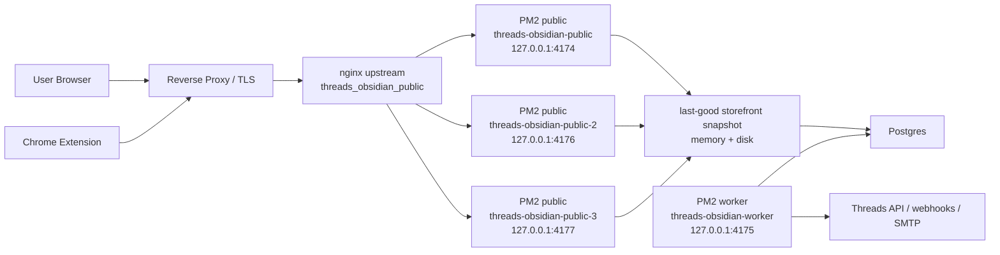

# Public Scale Rollout

기준일: `2026-03-29`

목표:

- public landing / checkout / storefront read 트래픽을 `PM2 public pool + nginx upstream` 기준으로 확장
- collector / monitoring autorun 같은 background work를 public workers와 분리
- DB가 흔들려도 public read는 `last-good snapshot`으로 최대한 계속 응답

이 문서는 `1만 public read 동시 요청`을 목표로 할 때의 운영 토폴로지와 롤아웃 절차를 정리한다.

## 1. 권장 토폴로지



핵심 원칙:

- 외부 public traffic은 nginx upstream `threads_obsidian_public`을 통해 public app pool로만 들어간다.
- `threads-obsidian-worker`는 reverse proxy에서 라우팅하지 않는다.
- public app pool은 collector / monitoring autorun을 끄고, worker만 background work를 맡는다.
- public app은 storefront snapshot warmup + `stale-while-revalidate` / `stale-if-error` 캐시로 DB 흔들림을 흡수한다.

## 2. 준비된 파일

- scaled PM2 config: [ecosystem.scale.config.cjs](/Users/parktaejun/Desktop/threads/ecosystem.scale.config.cjs)
- 단일 앱 기본 config: [ecosystem.config.cjs](/Users/parktaejun/Desktop/threads/ecosystem.config.cjs)

`THREADS_PM2_PUBLIC_INSTANCES`가 `3`이면 scaled config는 아래 앱들을 만든다.

- `threads-obsidian-public`
- `threads-obsidian-public-2`
- `threads-obsidian-public-3`
- `threads-obsidian-worker`

public 앱은 자동으로 아래 env override를 건다.

- `THREADS_WEB_DISABLE_COLLECTOR=true`
- `THREADS_WEB_DISABLE_MONITORING_AUTORUN=true`

worker 앱은 별도 override 없이 background work를 수행한다.

## 3. 권장 환경변수

`.env` 또는 PM2 env에 아래 값을 준비한다.

```bash
THREADS_WEB_PUBLIC_PORT=4174
THREADS_WEB_PUBLIC_HOST=127.0.0.1
THREADS_WEB_WORKER_PORT=4175
THREADS_WEB_WORKER_HOST=127.0.0.1
THREADS_PM2_PUBLIC_INSTANCES=3
THREADS_WEB_PERSIST_REQUEST_LOGS=false
THREADS_WEB_PUBLIC_STOREFRONT_CACHE_TTL_MS=60000
THREADS_WEB_PUBLIC_STOREFRONT_STALE_WHILE_REVALIDATE_MS=300000
THREADS_WEB_PUBLIC_STOREFRONT_STALE_IF_ERROR_MS=86400000
```

주의:

- reverse proxy가 같은 서버에 있으면 host는 `127.0.0.1`이 맞다.
- worker 포트는 public 라우팅에 연결하지 않는다.
- public 추가 포트는 `THREADS_WEB_PUBLIC_PORT`부터 시작해서 `THREADS_WEB_WORKER_PORT`를 건너뛰며 자동 생성된다.
- `THREADS_WEB_TRUST_PROXY_ALLOWLIST`는 reverse proxy peer IP 기준으로 계속 맞춰야 한다.

## 4. PM2 롤아웃

초기 전환:

```bash
npm run build
pm2 delete threads-obsidian || true
pm2 start ecosystem.scale.config.cjs
pm2 save
```

재배포:

```bash
npm run build
pm2 restart threads-obsidian-public --update-env
pm2 restart threads-obsidian-public-2 --update-env
pm2 restart threads-obsidian-public-3 --update-env
pm2 restart threads-obsidian-worker --update-env
pm2 save
```

권장:

- 전환 직후 `pm2 ls`
- `pm2 show threads-obsidian-public`
- `pm2 show threads-obsidian-public-2`
- `pm2 show threads-obsidian-public-3`
- `pm2 show threads-obsidian-worker`

를 확인해서 포트, 인스턴스 수, restart 상태를 점검한다.

## 5. reverse proxy 기준

repo 안에는 nginx 설정 파일이 없으므로 운영 장비에서 직접 반영해야 한다.

최소 요구사항:

- public origin은 nginx upstream `threads_obsidian_public`으로 proxy
- worker 포트 `127.0.0.1:4175`는 외부 route에서 제외
- `Host`, `X-Forwarded-For`, `X-Forwarded-Proto` 전달
- keepalive / buffering / timeout을 public read 기준으로 조정

예시 개념:

```nginx
upstream threads_obsidian_public {
  least_conn;
  server 127.0.0.1:4174 max_fails=3 fail_timeout=10s;
  server 127.0.0.1:4176 max_fails=3 fail_timeout=10s;
  server 127.0.0.1:4177 max_fails=3 fail_timeout=10s;
  keepalive 32;
}

location / {
  proxy_pass http://threads_obsidian_public;
  proxy_http_version 1.1;
  proxy_set_header Host $host;
  proxy_set_header X-Forwarded-For $proxy_add_x_forwarded_for;
  proxy_set_header X-Forwarded-Proto $scheme;
}
```

worker는 외부 route가 없어야 한다.

## 6. 롤아웃 검증

전환 직후 최소 검증:

```bash
curl -fsS https://ss-threads.dahanda.dev/health
curl -fsS https://ss-threads.dahanda.dev/ready
curl -fsS https://ss-threads.dahanda.dev/api/public/storefront -I
curl -fsS https://ss-threads.dahanda.dev/ -I
```

확인 포인트:

- `/health` => `200`
- `/ready` => `200`
- `/ready` 응답의 `trustProxy.ready` => `true`
- `/api/public/storefront` GET 응답 헤더에 `cache-control`, `etag` 존재
- landing 응답 헤더에 `cache-control`, `etag` 존재
- worker 포트는 외부에서 직접 접근되지 않음

## 7. 운영 부하 검증

public app pool 직접 확인:

```bash
autocannon -c 100 -d 15 http://127.0.0.1:4174/health
autocannon -c 100 -d 15 http://127.0.0.1:4174/api/public/storefront
autocannon -c 100 -d 15 http://127.0.0.1:4176/api/public/storefront
autocannon -c 100 -d 15 http://127.0.0.1:4177/api/public/storefront
```

그 다음 reverse proxy 경유로 `k6` 또는 `autocannon`을 써서 staged load를 올린다.

권장 단계:

1. `100 concurrent`
2. `500 concurrent`
3. `1000 concurrent`
4. `5000 concurrent`
5. `10000 concurrent`

목표는 `public read` 기준이다.

`POST /api/public/orders`, admin, webhook, collector까지 같은 방식으로 1만 동시를 기대하면 안 된다.

## 8. 아직 남는 일

이 구성은 public plane scale-out 준비까지다. 아래는 아직 별도 작업이 필요하다.

- reverse proxy 캐시 또는 CDN 캐시 실제 도입
- public storefront 전용 정규화 테이블로 완전 분리
- admin / webhook / background를 별도 서비스 단위로 더 분리
- 운영 부하 테스트 결과 기반 timeout / keepalive / proxy buffer 재튜닝

즉, 이 문서의 목표는 `배포 토폴로지 전환 준비`이며, 최종 1만 public read 처리량 보장은 운영 부하 테스트까지 끝내야 성립한다.
